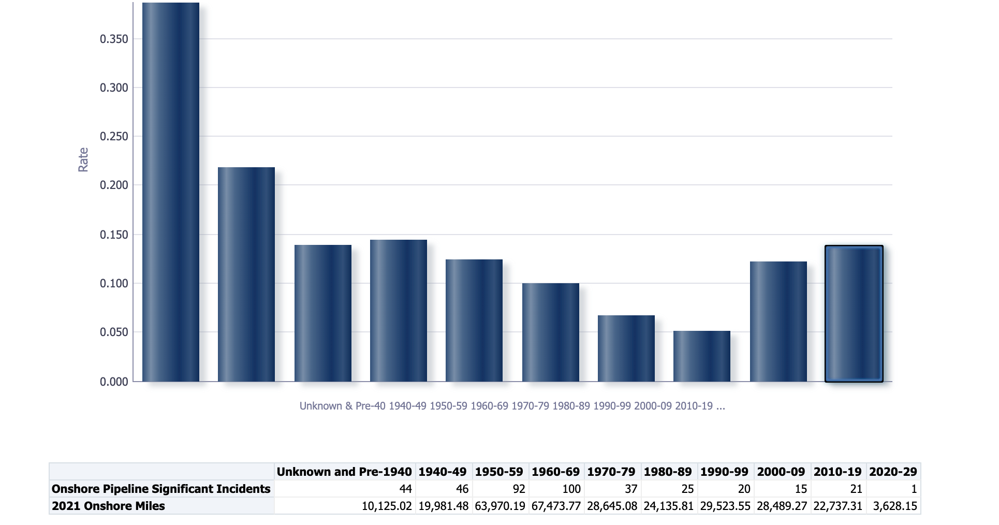

```{r include = FALSE, echo = FALSE}
rm(list = ls())
```

```{r setup, include=FALSE}
knitr::opts_chunk$set(echo = FALSE, include = FALSE)


library(tidyverse)
library(ggrepel)
library(RColorBrewer)
library(ggthemes)
library(viridis)
library(scales)
library(readxl)
library(kableExtra)
library(sp)
library(rgeos)
library(tufte)
library(rgdal)
library(showtext)


datadir <- "/Users/jameseager/Documents/proj/phmsa-clean/data/"
capt = "Source: PHMSA Incident and Mileage Data (2010-2021)"
tag = "PST 2022"
```

```{r theme_pst}
#> Loading required package: sysfonts
#> Loading required package: showtextdb
pstFont = "Montserrat"
font_add_google(pstFont)
showtext_auto()
theme_pst <- function(baseSize=10) {
  (theme(
                       axis.line.x = element_line(
                         colour = "#182125",
                         size = 0.5,
                         linetype = "solid"
                       ),
                       axis.ticks.x = element_blank(),
                       axis.line.y = element_line(
                         colour = "#182125",
                         size = 0.5,
                         linetype = "solid"
                       ),
                       axis.ticks.y = element_line(
                         colour = "#182125",
                         size = 0.5,
                         linetype = "solid"
                       ),
                       text = element_text(family = pstFont),
                       axis.text = element_text(colour = "#8C9394",
                                                size = baseSize * .8),
                       axis.title = element_text(colour ="black"),
                       panel.grid.minor.y = element_line(linetype = "dotted", 
                                                         colour = "#C4C8C6"),
                       panel.grid.major.y = element_line(colour = "#394C56", 
                                                         linetype = "dotted"),
                       panel.grid.major.x = element_blank(),
                       plot.tag.position = "topright",
                       plot.tag = element_text(size = baseSize *.66,
                                               colour = "#8C9394"),
                       panel.grid.minor.x = element_blank(),
                       panel.background = element_rect(fill = "#ffffff"),
                       panel.border = element_blank(),
                       strip.background = element_blank(),
                       strip.text = element_blank(),
                       strip.text.x = element_text(size = baseSize*.8, 
                                                   face = "bold"),
                       strip.text.y = element_blank(),
                       legend.text = element_text(colour = "black",
                                                  size = baseSize * .8),
                       legend.background = element_rect(fill = NULL, 
                                                        color = "#182125"),
                       legend.title = element_text( face = "bold", 
                                                    colour = "black",
                                                    size = baseSize),
                       legend.position = "right",
                       legend.key = element_blank(),
                       #legend.background = element_blank(),
                       plot.background = element_rect(fill = "#ffffff"),
                       plot.title = element_text(face = "bold", 
                                                 colour = "black",
                                                 size = baseSize*1.2),
                       plot.subtitle = element_text(colour = "#8C9394",
                                                    size = baseSize)
                     )
  )
}
```

```{r nice colors}
col <- brewer.pal(6,"Set2")
green <- col[1]
orange <- col[2]
purple <- col[3]
pink <- col[4]
lime <- col[5]
yellow <- col[6]
```

```{r loading data}
## mileage
df.gd <- read.csv(paste0(datadir,"GD_MilesDecadeAge.csv"))
df.gt <- read.csv(paste0(datadir,"GT_MilesDecadeAge.csv"))
df.hl <- read.csv(paste0(datadir,"HL_MilesDecadeAge.csv"))

## incidents
gd.inc <- read_csv(paste0(datadir,"all_inc.csv")) %>% filter(grepl("GD", SYSTEM_TYPE))
gt.inc <- read_csv(paste0(datadir,"all_inc.csv")) %>% filter(grepl("GT", SYSTEM_TYPE))
hl.inc <- read_csv(paste0(datadir,"all_inc.csv")) %>% filter(grepl("HL", SYSTEM_TYPE))

# phmsa 
gtPD <- read_csv(paste0(datadir,"incidents/GTOPSI.csv")) %>%
  rename(REPORT_NUMBER = `Report ID`)
```

```{r normalize bathtubs by miles}
#ok
gtMileNorm <- df.gt %>% 
  filter(!State.Abbreviation %in% c("OCSAT", "OCSG","OCSP"))%>%
  select(Calendar.Year, starts_with("X"), starts_with("Pre"))%>%
  rename(X1930 = Pre.1940.or.Unknown) %>%
  filter(Calendar.Year >= 2010)%>%
  group_by(Calendar.Year)%>%
  summarise(across(c(1:10),~sum(.,na.rm = T))) %>%
  pivot_longer(cols = starts_with("X"))%>%
  mutate(name = parse_number(str_sub(name, 2,5)))


hlMileNorm <- df.hl %>%
  select(Calendar.Year, starts_with("X")) %>%
  filter(Calendar.Year >= 2010)%>%
  group_by(Calendar.Year)%>%
  summarise(across(c(1:11),~sum(.,na.rm = T)))%>%
  pivot_longer(cols = starts_with("X"))%>%
  mutate(name = parse_number(str_sub(name, 2,5)))


```

## Definitions

-   Installation Year: The year a failed part was put in place (not necessarily manufactured): usually grouped by decade in this analysis
    -   manufactured vs install year is hard to compare since the former is rarely given
-   Decade-year: Referring to the rate of pipeline failure attributable to a given install decade in a specific incident year
    -   i.e. The rate of 1960's incidents in 2015
-   Incident Rate: Always given in incidents per 1,000 miles in this presentation
-   Period of Interest: 2012 to 2021, but we *can* go back to 2010
    -   sticking to PHMSA's timeline just for ease of comparison for now
-   In plots, PHMSA or PST U is for unweighted averages, while PHMSA or PST W is a weighted average

## Aligning with PHMSA

#### GT Incident Characteristics:

-   10 most recent *complete* calendar years (2012-2021)
-   Significant
-   *Onshore* Pipeline, including valve sites

```{r echo=TRUE, eval=FALSE, include = TRUE}
gt.inc %>%
  mutate(INSTALLATION_YEAR = parse_number(INSTALLATION_YEAR,na = c("NA","UNKNOWN")),             
         INSTALLATION_DECADE = INSTALLATION_YEAR - INSTALLATION_YEAR %% 10,
         INSTALLATION_DECADE = if_else(INSTALLATION_DECADE <= 1930, 1930, INSTALLATION_DECADE),
         INSTALLATION_DECADE = replace_na(INSTALLATION_DECADE, 1920))%>%  
  ### <b>
  filter(SIGNIFICANT == "YES",   
         ON_OFF_SHORE == "ONSHORE",  
         between(IYEAR, 2012,2021),
         SYSTEM_PART_INVOLVED == "ONSHORE PIPELINE, INCLUDING VALVE SITES" )
  ### </b>

```

## PHMSA's Graph

{width="90%"}

## My Graph

```{r matching phmsa?, include = TRUE, message = FALSE}
#years to decade
gt2 <- gt.inc %>%
  mutate(INSTALLATION_YEAR = parse_number(INSTALLATION_YEAR,
                                          na = c("NA","UNKNOWN","N/A")),
         INSTALLATION_YEAR = replace_na(INSTALLATION_YEAR, 1930),
         INSTALLATION_DECADE = INSTALLATION_YEAR - INSTALLATION_YEAR %% 10 ,
         INSTALLATION_DECADE = if_else(INSTALLATION_DECADE <= 1930, 1930, INSTALLATION_DECADE))%>%
  filter(SIGNIFICANT == "YES",
         SYSTEM_PART_INVOLVED == "ONSHORE PIPELINE, INCLUDING VALVE SITES" ,
         ON_OFF_SHORE == "ONSHORE",
        # INSTALLATION_DECADE>=1930,
         IYEAR < 2022,
         IYEAR > 2011)%>%
  left_join(gtMileNorm,                   
            by = c("INSTALLATION_DECADE" = "name", "IYEAR" = "Calendar.Year"),             
            keep = T) %>%
  group_by(INSTALLATION_DECADE)%>%
  summarise(n = n(),
            miles = mean(value),
            s.ipm = round(n/(miles/1000),1))%>%
  mutate(version = "PST U")


gtphmsaU <- tibble(INSTALLATION_DECADE = unique(gt2$INSTALLATION_DECADE),
                  version = rep("PHMSA U", length(unique(gt2$INSTALLATION_DECADE))),
                  s.ipm = c(3.8, 2.1,1.4,1.45, 1.2,1,0.6,0.5,1.2,1.4)
                  )

  
gtphmsaW <- gtPD %>%
  rename(INSTALLATION_YEAR = `Install Year Failed Item`,
         IYEAR = `Incident Year`
         )%>%
  mutate(INSTALLATION_YEAR = replace_na(INSTALLATION_YEAR, 1930),
         INSTALLATION_DECADE = INSTALLATION_YEAR - INSTALLATION_YEAR %% 10 ,
         INSTALLATION_DECADE = if_else(INSTALLATION_DECADE <= 1930, 1930, INSTALLATION_DECADE))%>%
  left_join(gtMileNorm,                   
            by = c("INSTALLATION_DECADE" = "name", "IYEAR" = "Calendar.Year"),             
            keep = T) %>%
  group_by(INSTALLATION_DECADE, IYEAR)%>%                                       
  summarise(n = n(),                                                         
            miles = mean(value),                                             
            ipm = n/(miles/1000)) %>%                                         
  group_by(INSTALLATION_DECADE)%>%            
  mutate(count = if_else(INSTALLATION_DECADE == 2020, 
                         as.integer(2),
                         as.integer(10)))%>%
  summarise(total = sum(n),   
            iyear = IYEAR, 
            w.ipm = ipm * (n/total),   
            count = count,
            s.ipm = round(sum(w.ipm)*count,1)) %>%
  distinct(INSTALLATION_DECADE,.keep_all = T)%>%                                
  mutate(version = "PHMSA W")
  
  
gtpstW <- gt.inc %>%
  mutate(INSTALLATION_YEAR = parse_number(INSTALLATION_YEAR,                 
                                          na = c("NA","UNKNOWN","N/A")),    
         INSTALLATION_YEAR = replace_na(INSTALLATION_YEAR, 1930),           
         INSTALLATION_DECADE = INSTALLATION_YEAR - INSTALLATION_YEAR %% 10,
         INSTALLATION_DECADE = if_else(INSTALLATION_DECADE <= 1930, 1930, INSTALLATION_DECADE))%>%
  filter(SIGNIFICANT == "YES",   
         SYSTEM_PART_INVOLVED == "ONSHORE PIPELINE, INCLUDING VALVE SITES" ,
         ON_OFF_SHORE == "ONSHORE",  
         IYEAR !=2022,
         IYEAR > 2011)%>%
  left_join(gtMileNorm,                   
            by = c("INSTALLATION_DECADE" = "name", "IYEAR" = "Calendar.Year"),             
            keep = T)%>%                                                        
  #filter(!is.na(value))%>%                                                  
  group_by(INSTALLATION_DECADE, IYEAR)%>%                                       
  summarise(n = n(),                                                         
            miles = mean(value),                                             
            ipm = n/(miles/1000)) %>%                                         
  group_by(INSTALLATION_DECADE)%>%            
  mutate(count = if_else(INSTALLATION_DECADE == 2020, 
                         as.integer(2),
                         as.integer(10)))%>%
  summarise(total = sum(n),   
            iyear = IYEAR, 
            w.ipm = ipm * (n/total),   
            count = count,
            s.ipm = round(sum(w.ipm)*count,1))%>%                            
  distinct(INSTALLATION_DECADE,.keep_all = T)%>%                                
  mutate(version = "PST W")

rbind(gtpstW, gt2, gtphmsaU, gtphmsaW)%>%                                                        
  ggplot(aes(x = INSTALLATION_DECADE, y = s.ipm, fill = version, group = version))+ 
  geom_bar(stat = "identity", position = "dodge")+
  geom_text(aes(label = s.ipm, family = pstFont), 
            vjust = 1.5, colour = "white", position = position_dodge(width = 9.3), size = 2.7)+
  theme_pst(baseSize = 12)+
  scale_x_continuous(limits = c(1925,2025),
                     breaks = seq(1930, 2010,20),
                     labels = c("Pre-40s\n& Unkown",seq(1950,2010,20)))+
  scale_fill_brewer(palette = "Paired", direction = -1)+
  theme(legend.position = c(.7,.7))+
  labs(title = "Pipeline Incidents Per 1,000 Miles by Installation Decade",
       subtitle = "Significant Incidents of Onshore Gas Transmission Lines from the 1940s to Present",
       caption = capt,
       tag = "PST 2022",
       y = "Incidents per 1,000 Miles",
       x = "Installation Decade")
```

## Misalignment

-   Approach to "averages"
    -   Weighted mean takes into account changes in incidents counts and mileage
-   Weird math in PHMSA's 2020s: SQL or other issues?
-   Inclusion of other incident parts and locations
    -   Parts: compressor stations, storage, regulator/metering\
    -   Locations: offshore (platforms?)
-   Another consideration is potentially examining incidents by age of part at the time of incident
    -   A little less clear when it comes to using mileage by decade

## Arithmetic Mean

$$
\mu_d =  \frac{\sum_{y = 2012}^{2021}Inc_{dy}}{\sum_{y = 2012}^{2021}Miles_{dy}}
$$

-   $Inc$ = Number of incidents in a given period
-   $d$ = Decade of a given installation year (40s through 2020s)
-   $y$ = Year incident occurred (2011-2021)
-   $\mu$ = Average incident rate for a given $d$

## Weighted Mean

How do we "weigh" the mean? By adjusting the raw incident rate in a given decade-year. Notice that this time $\mu_{dy}$ is only for a specific decade-year ($dy$) and $mu_d$ involves multiplying the sum of $\mu_{dy}$ by the number of possible incident years it includes (10, except in the 2020's).

$$
\begin{aligned}
  \mu_{dy} = \frac{Inc_{dy}}{Mileage_{dy}}* \frac{Inc_{dy}}{Inc_{d}}\\
  \mu_d = \frac{\Sigma_{y=2012}^{2021}{\mu_{dy}}}{10}\\
\end{aligned}
$$

## Weighted Mean Plot

```{r decade year plots, include = TRUE, message = FALSE}
gt.inc %>%
  mutate(INSTALLATION_YEAR = parse_number(INSTALLATION_YEAR,                 
                                          na = c("NA","UNKNOWN","N/A")),    
         INSTALLATION_YEAR = replace_na(INSTALLATION_YEAR, 1930),           
         INSTALLATION_DECADE = INSTALLATION_YEAR - INSTALLATION_YEAR %% 10,
         INSTALLATION_DECADE = if_else(INSTALLATION_DECADE <= 1930, 1930, INSTALLATION_DECADE))%>%
  filter(SIGNIFICANT == "YES",   
         ON_OFF_SHORE == "ONSHORE",  
         IYEAR !=2022,
         IYEAR > 2011,
         INSTALLATION_DECADE != 2020)%>%
  left_join(gtMileNorm,                   
            by = c("INSTALLATION_DECADE" = "name", "IYEAR" = "Calendar.Year"),             
            keep = T)%>%                                                        
  #filter(!is.na(value))%>%                                                  
  group_by(INSTALLATION_DECADE, IYEAR)%>%                                       
  summarise(n = n(),                                                         
            miles = mean(value),                                             
            ipm = n/(miles/1000)) %>%                                         
  group_by(INSTALLATION_DECADE)%>%            
  mutate(count = if_else(INSTALLATION_DECADE == 2020, 
                         as.integer(2),
                         as.integer(12)))%>%
  mutate(total = sum(n),   
            iyear = IYEAR, 
            w.ipm = ipm * (n/total),   
            count = count,
            s.ipm = round(sum(w.ipm)*count,1),
         w = n/total)%>%                            
  distinct(INSTALLATION_DECADE, iyear,.keep_all = T)%>% 
  ggplot(aes(x = iyear, y = ipm, group = as.factor(INSTALLATION_DECADE), color = as.factor(INSTALLATION_DECADE)))+
  geom_point(aes(size = w), alpha = .8)+
  geom_line()+
  scale_color_brewer(palette = "Spectral", name = "Decade Installed", labels = c("Pre-40s\n& Unkown",seq(1940,2010,10)))+
  scale_size_continuous(name = "Weight")+
  theme_pst()+
  labs(x = "Incident Year", y = "Incidents per 1K Miles", 
       title = "Decade-Year Incident Rate Trends",
       subtitle = "Significant Incidents of Onshore Gas Transmission Lines from the 1940s to Present" )

```

## What about the 2020s?

Why does PHMSA present an incident rate of around 1.4 in the 2020s? Below is a table of all incidents in the relevant period (2012-2021), relevant filters, and an install year in the 2020s.

```{r twentyone, include = TRUE}
gt.inc %>%
  filter(SIGNIFICANT == "YES",
         SYSTEM_PART_INVOLVED == "ONSHORE PIPELINE, INCLUDING VALVE SITES",
         INSTALLATION_YEAR >2019,
         INSTALLATION_YEAR != "UNKNOWN")%>%
  mutate(INSTALLATION_YEAR = parse_number(INSTALLATION_YEAR,                 
                                          na = c("NA","UNKNOWN","N/A")),    
         INSTALLATION_YEAR = replace_na(INSTALLATION_YEAR, 1930),           
         INSTALLATION_DECADE = INSTALLATION_YEAR - INSTALLATION_YEAR %% 10,
         INSTALLATION_DECADE = if_else(INSTALLATION_DECADE <= 1930, 1930, INSTALLATION_DECADE))%>%
  left_join(gtMileNorm,                   
            by = c("INSTALLATION_DECADE" = "name", "IYEAR" = "Calendar.Year"),             
            keep = T)%>%
  select(NAME, ILOC, SIGNIFICANT, IYEAR, INSTALLATION_YEAR, value)%>%
  kbl(col.names = c("Operator","Location","SIGNIFICANT","Inc. Yr.","Inst. Yr.","Dec-Yr Mileage"),
      format.args = list(big.mark = ","), digits = 0,booktabs = T)%>%
  kable_classic_2()

```

<br> 1 incident in a year with 3,628 miles offers a rate of .28 for the year. Due to a lack of 20-20 decade-year incidents, the weighted average is .56 while the unweighted is .14. Either way, a single incident in a single year is basically statistical noise, and inconclusive.

## Adjusting the Filters

So how may incidents are we actually looking at?

```{r pressure, include = T, message = F}
modeFind <- function(x) {
  x <- x[!is.na(x)]
  ux <- unique(x)
  tab <- tabulate(match(x, ux))
  ux[tab == max(tab)]
}

gt.inc %>%
  filter(SIGNIFICANT == "YES",
         between(IYEAR, 2012, 2021))%>%
  mutate(INSTALLATION_YEAR = parse_number(INSTALLATION_YEAR,                 
                                          na = c("NA","UNKNOWN","N/A")))%>%
  group_by(SYSTEM_PART_INVOLVED)%>%
  summarise(incidents = n(),
            mean = mean(INSTALLATION_YEAR, na.rm = T),
            median = median(INSTALLATION_YEAR, na.rm = T),
            mode = modeFind(INSTALLATION_YEAR)) %>%
  mutate(SYSTEM_PART_INVOLVED = str_trunc(SYSTEM_PART_INVOLVED, 25))%>%
  distinct(SYSTEM_PART_INVOLVED, .keep_all = T)%>%
  kbl(col.names = c("Part", "n", "Mean", "Median", "Mode"),
      booktabs = T, digits = 0)%>%
  add_header_above(c(" "=2, "Install Year" = 3))%>%
  kable_classic_2()
  


```

## In Short:

-   677 in the time period we are looking at
-   59% are currently included in PHMSA's analysis
-   Offshore incidents (which we have mileage for, sort of) would increase that to 70% of incidents

## Why Don't I Have a Plot Including Offshore Incidents?

"User hostile" doesn't even begin to touch how much more complicated the offshore mileage reporting is. Aside pipeline with OCSG, OCSP, and OCSAT in the State column, the per-decade mileage of offshore pipeline is slightly unclear and requires some investigation with PHMSA.

It seems like in some cases offshore and onshore mileage reporting is mixed, so why is PHMSA reporting rates for only onshore? I have no idea, but the more I investigate this topic the more confused I am about everything I've heard from them. Also, I have only just noticed the PHMSA column in the incident data that mentions OCS incidents, and just haven't incorporated that yet.

## What About Other Onshore Parts?

```{r include = TRUE, message = FALSE}
gtphmsaW <- gtPD %>%
  rename(INSTALLATION_YEAR = `Install Year Failed Item`,
         IYEAR = `Incident Year`
         )%>%
  mutate(INSTALLATION_YEAR = replace_na(INSTALLATION_YEAR, 1930),
         INSTALLATION_DECADE = INSTALLATION_YEAR - INSTALLATION_YEAR %% 10 ,
         INSTALLATION_DECADE = if_else(INSTALLATION_DECADE <= 1930, 1930, INSTALLATION_DECADE))%>%
  left_join(gtMileNorm,                   
            by = c("INSTALLATION_DECADE" = "name", "IYEAR" = "Calendar.Year"),             
            keep = T) %>%
  group_by(INSTALLATION_DECADE, IYEAR)%>%                                       
  summarise(n = n(),                                                         
            miles = mean(value),                                             
            ipm = n/(miles/1000)) %>%                                         
  group_by(INSTALLATION_DECADE)%>%            
  mutate(count = if_else(INSTALLATION_DECADE == 2020, 
                         as.integer(2),
                         as.integer(10)))%>%
  summarise(total = sum(n),   
            iyear = IYEAR, 
            w.ipm = ipm * (n/total),   
            count = count,
            s.ipm = round(sum(w.ipm)*count,1)) %>%
  distinct(INSTALLATION_DECADE,.keep_all = T)%>%                                
  mutate(version = "PHMSA")
  
  
gtpstW <- gt.inc %>%
  mutate(INSTALLATION_YEAR = parse_number(INSTALLATION_YEAR,                 
                                          na = c("NA","UNKNOWN","N/A")),    
         INSTALLATION_YEAR = replace_na(INSTALLATION_YEAR, 1930),           
         INSTALLATION_DECADE = INSTALLATION_YEAR - INSTALLATION_YEAR %% 10,
         INSTALLATION_DECADE = if_else(INSTALLATION_DECADE <= 1930, 1930, INSTALLATION_DECADE))%>%
  filter(SIGNIFICANT == "YES",   
         ON_OFF_SHORE == "ONSHORE",  
         IYEAR !=2022,
         IYEAR > 2011)%>%
  left_join(gtMileNorm,                   
            by = c("INSTALLATION_DECADE" = "name", "IYEAR" = "Calendar.Year"),             
            keep = T)%>%                                                        
  #filter(!is.na(value))%>%                                                  
  group_by(INSTALLATION_DECADE, IYEAR)%>%                                       
  summarise(n = n(),                                                         
            miles = mean(value),                                             
            ipm = n/(miles/1000)) %>%                                         
  group_by(INSTALLATION_DECADE)%>%            
  mutate(count = if_else(INSTALLATION_DECADE == 2020, 
                         as.integer(2),
                         as.integer(10)))%>%
  summarise(total = sum(n),   
            iyear = IYEAR, 
            w.ipm = ipm * (n/total),   
            count = count,
            s.ipm = round(sum(w.ipm)*count,1))%>%                            
  distinct(INSTALLATION_DECADE,.keep_all = T)%>%                                
  mutate(version = "PST: All On")

rbind(gtpstW, gtphmsaW)%>%                                                        
  ggplot(aes(x = INSTALLATION_DECADE, y = s.ipm, fill = version, group = version))+ 
  geom_bar(stat = "identity", position = "dodge")+
  geom_text(aes(label = s.ipm, family = pstFont), 
            vjust = 1.5, colour = "white", position = position_dodge(width = 9.3), size = 2.7)+
  theme_pst(baseSize = 12)+
  scale_x_continuous(limits = c(1925,2025),
                     breaks = seq(1930, 2010,20),
                     labels = c("Pre-40s\n& Unkown",seq(1950,2010,20)))+
  scale_fill_brewer(palette = "Set2", direction = -1)+
  theme(legend.position = c(.7,.7))+
  labs(title = "Pipeline Incidents Per 1,000 Miles by Installation Decade",
       subtitle = "Significant Incidents of Onshore Gas Transmission Lines from the 1940s to Present",
       caption = capt,
       tag = "PST 2022",
       y = "Incidents per 1,000 Miles",
       x = "Installation Decade")
```

## Installation Decades and Failed Parts \| Description

This next plot is a bit confusing so needs a bit more introduction. It shows the percentage of significant incidents attributable to a specific part that was installed in a given decade. In other words, one of two incidents attributable to Aboveground Storage occurred on a storage part that was installed in the 1980s, thus the aboveground storage part registers 50% in the 1980s column (the other incident was attributable to AS part installed in the 2020s, so it's 50% there as well). I used percentages here to account for the vastly different incident counts attributable to each part (from 2 to 401), although it is a bit less immediately intuitive. What I hope is visible from this is a relative increase in compressor station and onshore regulator incidents installed after the 1980s (green and orange dots).

## Installation Decades and Failed Parts \| Plot

```{r message = F, include=T}
gt.inc %>%
  mutate(INSTALLATION_YEAR = parse_number(INSTALLATION_YEAR,                 
                                          na = c("NA","UNKNOWN","N/A")),    
         INSTALLATION_YEAR = replace_na(INSTALLATION_YEAR, 1930),           
         INSTALLATION_DECADE = INSTALLATION_YEAR - INSTALLATION_YEAR %% 10,
         INSTALLATION_DECADE = if_else(INSTALLATION_DECADE <= 1930, 1930, INSTALLATION_DECADE))%>%
  filter(SIGNIFICANT == "YES",   
         ON_OFF_SHORE == "ONSHORE",  
         IYEAR !=2022,
         IYEAR > 2011)%>%
  group_by(INSTALLATION_DECADE, SYSTEM_PART_INVOLVED)%>%
  summarise(n = n()) %>%
  ungroup()%>%
  group_by(SYSTEM_PART_INVOLVED)%>%
  mutate(tot = sum(n))%>%
  ungroup()%>%
  mutate(cool = n/tot,
         SYSTEM_PART_INVOLVED = str_trunc(SYSTEM_PART_INVOLVED, 20))%>%
  complete(SYSTEM_PART_INVOLVED, INSTALLATION_DECADE, fill = list(cool = 0))%>%
  ggplot(aes(x = INSTALLATION_DECADE, y = cool, 
             group = SYSTEM_PART_INVOLVED, color = SYSTEM_PART_INVOLVED))+
  geom_point(alpha = .8, size = 2)+
  geom_line()+
  theme_pst()+
  scale_color_brewer(palette = "Set1", name = "Part")+
  scale_x_continuous(breaks = seq(1930,2020,20),
                     labels = c("P40&U", seq(1950,2020,20)))+
  labs(title = "System Part Incident Shares per Install Decade",
       subtitle = "Significant Incidents of All Gas Transmission Lines from the 1940s to Present",
       caption = capt,
       tag = "PST 2022",
       y = "Percent of Total Incidents per System Part",
       x = "Installation Decade")+
  theme(legend.position = c(.175,.775),
        legend.background = element_rect(fill = rgb(1,1,1,.6)))
```

## Unknown?

Apparently, the mileage data download has *separate* columns for *Onshore* Pre-40s and Unknown mileage. What does it look like when we separate them?

```{r unknown phmsa?, include = TRUE, message = FALSE}
#ok
gtMileNorm <- df.gt %>% 
  filter(!State.Abbreviation %in% c("OCSAT", "OCSG","OCSP"))%>%
  rename(X1930 = Trans.pre.1940.Onshore.Miles,
         X1920 = Trans.Unknown.by.Dec.Onshore.Miles) %>%
  select(Calendar.Year, starts_with("X"))%>%
  filter(Calendar.Year >= 2010)%>%
  group_by(Calendar.Year)%>%
  summarise(across(c(1:11),~sum(.,na.rm = T))) %>%
  pivot_longer(cols = starts_with("X"))%>%
  mutate(name = parse_number(str_sub(name, 2,5)))
#years to decade
gt2 <- gt.inc %>%
  mutate(INSTALLATION_YEAR = parse_number(INSTALLATION_YEAR,na = c("NA","UNKNOWN")),             
         INSTALLATION_DECADE = INSTALLATION_YEAR - INSTALLATION_YEAR %% 10,
         INSTALLATION_DECADE = if_else(INSTALLATION_DECADE <= 1930, 1930, INSTALLATION_DECADE),
         INSTALLATION_DECADE = replace_na(INSTALLATION_DECADE, 1920))%>%
  filter(SIGNIFICANT == "YES",
         SYSTEM_PART_INVOLVED == "ONSHORE PIPELINE, INCLUDING VALVE SITES" ,
         ON_OFF_SHORE == "ONSHORE",
        # INSTALLATION_DECADE>=1930,
         IYEAR < 2022,
         IYEAR > 2011)%>%
  left_join(gtMileNorm,                   
            by = c("INSTALLATION_DECADE" = "name", "IYEAR" = "Calendar.Year"),             
            keep = T) %>%
  group_by(INSTALLATION_DECADE)%>%
  summarise(n = n(),
            miles = mean(value),
            s.ipm = round(n/(miles/1000),1))%>%
  mutate(version = "PST U")


gtphmsaU <- tibble(INSTALLATION_DECADE = unique(gt2$INSTALLATION_DECADE),
                  version = rep("PHMSA U", length(unique(gt2$INSTALLATION_DECADE))),
                  s.ipm = c(0, 3.8, 2.1,1.4,1.45, 1.2,1,0.6,0.5,1.2,1.4)
                  )

  
gtphmsaW <- gtPD %>%
  rename(INSTALLATION_YEAR = `Install Year Failed Item`,
         IYEAR = `Incident Year`
         )%>%
  mutate(INSTALLATION_DECADE = INSTALLATION_YEAR - INSTALLATION_YEAR %% 10,
         INSTALLATION_DECADE = if_else(INSTALLATION_DECADE <= 1930, 1930, INSTALLATION_DECADE),
         INSTALLATION_DECADE = replace_na(INSTALLATION_DECADE, 1920))%>%
  left_join(gtMileNorm,                   
            by = c("INSTALLATION_DECADE" = "name", "IYEAR" = "Calendar.Year"),             
            keep = T) %>% 
  group_by(INSTALLATION_DECADE, IYEAR)%>%                                       
  summarise(n = n(),                                                         
            miles = mean(value),                                             
            ipm = n/(miles/1000))%>%                                        
  group_by(INSTALLATION_DECADE)%>%            
  mutate(count = if_else(INSTALLATION_DECADE == 2020, 
                         as.integer(2),
                         as.integer(10)))%>%
  summarise(total = sum(n),   
            iyear = IYEAR, 
            w.ipm = ipm * (n/total),   
            count = count,
            s.ipm = round(mean(ipm)*count,1)) %>%
  distinct(INSTALLATION_DECADE,.keep_all = T)%>%                                
  mutate(version = "PHMSA U")
  
  
gtpstW <- gt.inc %>%
  mutate(INSTALLATION_YEAR = parse_number(INSTALLATION_YEAR,na = c("NA","UNKNOWN")),             
         INSTALLATION_DECADE = INSTALLATION_YEAR - INSTALLATION_YEAR %% 10,
         INSTALLATION_DECADE = if_else(INSTALLATION_DECADE <= 1930, 1930, INSTALLATION_DECADE),
         INSTALLATION_DECADE = replace_na(INSTALLATION_DECADE, 1920))%>%
  filter(SIGNIFICANT == "YES",   
         SYSTEM_PART_INVOLVED == "ONSHORE PIPELINE, INCLUDING VALVE SITES" ,
         ON_OFF_SHORE == "ONSHORE",  
         IYEAR !=2022,
         IYEAR > 2011)%>%
  left_join(gtMileNorm,                   
            by = c("INSTALLATION_DECADE" = "name", "IYEAR" = "Calendar.Year"),             
            keep = T)%>%                                                        
  #filter(!is.na(value))%>%                                                  
  group_by(INSTALLATION_DECADE, IYEAR)%>%                                       
  summarise(n = n(),                                                         
            miles = mean(value),                                             
            ipm = n/(miles/1000)) %>%                                         
  group_by(INSTALLATION_DECADE)%>%            
  mutate(count = if_else(INSTALLATION_DECADE == 2020, 
                         as.integer(2),
                         as.integer(10)))%>%
  summarise(total = sum(n),   
            iyear = IYEAR, 
            w.ipm = ipm * (n/total),   
            count = count,
            s.ipm = round(sum(w.ipm)*count,1))%>%                            
  distinct(INSTALLATION_DECADE,.keep_all = T)%>%                                
  mutate(version = "PST W")

rbind(gtpstW, gtphmsaW)%>%   
  ggplot(aes(x = INSTALLATION_DECADE, y = s.ipm, fill = version, group = version))+ 
  geom_bar(stat = "identity", position = "dodge")+
  geom_text(aes(label = s.ipm, family = pstFont), 
            vjust = 1.5, colour = "white", position = position_dodge(width = 9.3), size = 2.5)+
  theme_pst(baseSize = 12)+
  scale_x_continuous(limits = c(1915,2025),
                     breaks = seq(1920, 2020,20),
                     labels = c("Unknown",seq(1940,2020,20)))+
  scale_fill_brewer(palette = "Set2")+
  theme(legend.position = c(.85,.7))+
  labs(title = "Pipeline Incidents Per 1,000 Miles by Installation Decade",
       subtitle = "Significant Incidents of Onshore Gas Transmission Lines from the 1940s to Present",
       caption = capt,
       tag = "PST 2022",
       y = "Incidents per 1,000 Miles",
       x = "Installation Decade")
```

## Final Q's

*PHMSA*

-   Is there a credible way to handle offshore mileage and incidents?
    -   If not, why?
-   Why are they still presenting rates as incidents per 100 miles but calling it per 1,000?

*PST*

-   Hw do we handle non-pipeline & valve site incidents (compressor stations, storage, etc.)?
-   How do we handle "unknown" years/decades?
-   Does using 10 years vs all 12 matter?
